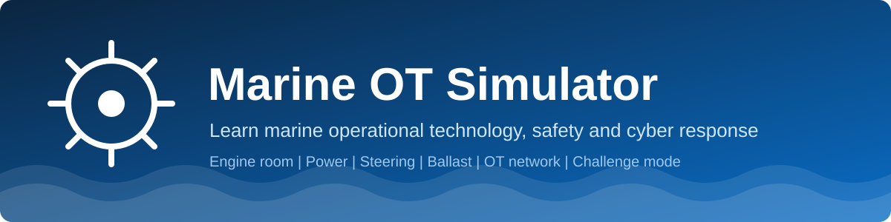
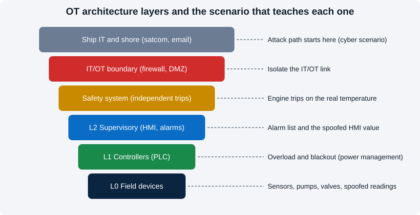

# Marine OT Simulator

**A free, browser-based trainer for marine operational technology (OT): run an engine room, handle faults, and practise cyber-incident response.**

[Live demo](https://nkcodegit.github.io/Marine-OT-Simulator/) · 
[Report an issue](https://github.com/nkcodegit/Marine-OT-Simulator/issues)

Developed and owned by **N. Kugan** · © 2026 · All rights reserved

---

## What is this?
Ships run on OT: sensors, PLCs, alarm systems and safety shutdowns that control engines, generators, pumps, steering and ballast. This app lets you **practise on a simulated plant** instead of a real vessel, and shows how a technical fault or a cyber attack looks to the crew.

It is a single static web app: no server, no install, no build step. Open it in a browser and start.

## What you will use it to study
| Topic | What you practise |
|---|---|
| Engine room basics | Telegraph, engine speed, jacket water, lube oil pressure, exhaust temperature, fuel |
| Power management | Generator capacity, overload, blackout and how it cascades |
| Alarms and trips | Alarm acknowledgement, high/low alarms, independent safety shutdowns |
| Auxiliary systems | Cooling pumps, bilge pump (auto/manual), steering gear pumps |
| Stability | Ballast tanks, heel and trim, correcting a list |
| OT cyber security | Spoofed sensor data, remote-access attack path, IT/OT segmentation, isolating a link |
| Response skills | Diagnose and act under time pressure, scored in challenge mode |

## Features
- **Live animated engine room**: pistons, flywheel, propeller, cooling and fuel flow, exhaust smoke, generators and bilge.
- **Steering gear and ballast diagrams** with rudder, heel and trim animation.
- **OT network map** that lights up during the cyber scenario, with an *Isolate IT/OT link* response.
- **Six injectable scenarios**: cooling pump failure, lube oil leak, bilge ingress, steering pump failure, ballast valve leak, spoofed sensor.
- **OT architecture explorer**: tap a layer for its role, threats, defences and the matching scenario.
- **Learning guide**: 10 steps, each with a flow diagram, detailed explanation and a *Run this step* button.
- **Quiz tab**: 10 questions with instant feedback.
- **Challenge mode**: six surprise faults, scored on response time, rated Cadet to Chief Engineer.
- **Sound alarms** (optional) and **guest login** (optional free accounts via Firebase).

## How to learn with it
1. Open the **Learning guide** tab and press **Run this step** on step 1.
2. Follow *Do / Observe / Learn* in the step panel, open **More details**, then **Mark done & next**.
3. Finish all 10 steps, then take the **Quiz** tab.
4. Go to **Challenge mode** (top of the Simulator tab) and try to reach *Chief Engineer*.

| Challenge score | Rating |
|---|---|
| 85% or more | Chief Engineer |
| 65% to 84% | Second Engineer |
| 45% to 64% | Watchkeeper |
| Below 45% | Cadet, keep practising |

Per fault: 8 s or less = 100 points, up to 15 s = 85, up to 25 s = 65, slower = 40, not handled = 0.

## Login
- **Guest login** works out of the box: enter a nickname.

## Tech
Plain HTML, CSS and JavaScript with inline SVG animation. No frameworks or build tools.

## Disclaimer
This is a **training aid** with a simplified model. Values, limits and behaviour do not match any real vessel or equipment. Never use it to operate or make decisions about real ship systems.

## Licence and ownership
The sole developer and full owner of this project is **N. Kugan**. All rights reserved: see [LICENSE](LICENSE). Written permission from the owner is needed to copy, modify, redistribute or use it commercially.
